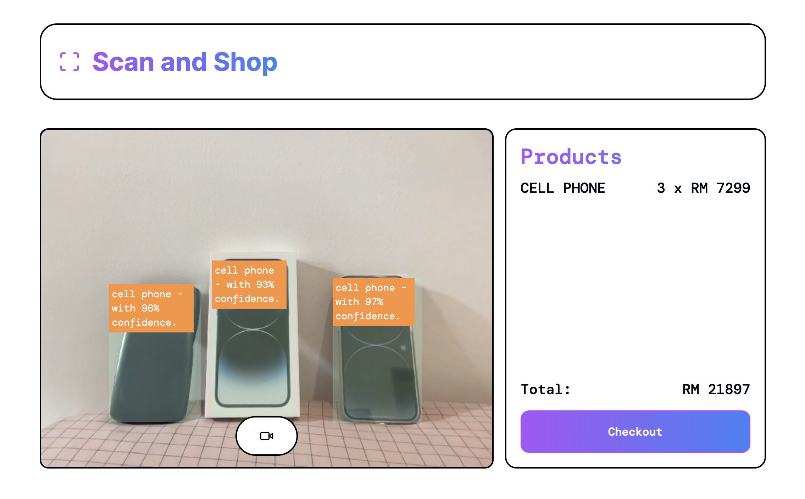

# Object Detection Demo deployed on the edge

The models get loaded directly to client's browser to perform real-time inference.

 

    

 

# Tech Stack

1. next.js
2. typescript
3. tailwind css
4. shadcnui
5. tfjs

# Future Improvement (Open for contributions)

1. custom pytorch YOLO model (currently only SSD)
2. object tracking (track object ids)
3. responsive (currently only support 640 x 480)
